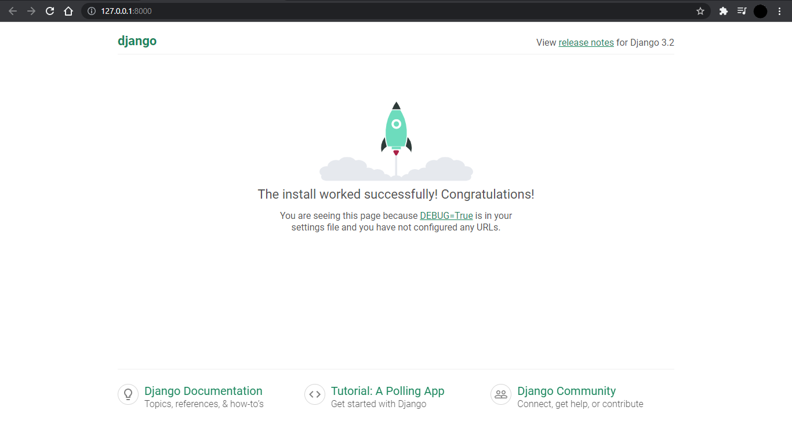
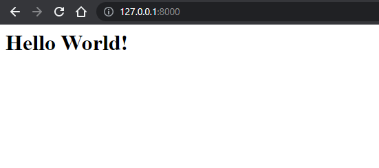

<div align="center" >

<h1> Django Guide</h1>

<p float="left">
  

 


</p>

### [Django Documentation](https://docs.djangoproject.com/en/3.2/topics/)

</div>

### Contents
- [Django Setup](#1-django-setup)
- [First App](#2-first-app)
---
## 1. [Django Setup]()
Python installation required.
### Install Virtual Environment
  ```
  pip install virtualenv
  ```
  
### Activate Virtual Environment
  ```
  ./env/Scripts/activate
  ```

### Install django using pip
  ```
  pip install django
  ```

### Confirm django installation
  ```
  django-admin --version
  ```

### Creating Project
```
django-admin startproject djangoproject
```

`cd djangoproject`

```
djangoproject
  |__ djangoproject
  |     |__ init.py
  |     |__ asgi.py
  |     |__ settings.py
  |     |__ urls.py
  |     |__ wsgi.py
  |__ manage.py
```

### Starting the Development Server
```
python manage.py runserver
```

**Result :**

```
Django version 3.2.6, using settings 'djangoproject.settings'
Starting development server at http://127.0.0.1:8000/        
Quit the server with CTRL-BREAK.
```

> The development server is live at 
**http://127.0.0.1:8000/**

To Stop the Server
 **CTRL + C** 



---
## 2. [First App]()

### Create a New App
```
python manage.py startapp myapp
```
It will create a new app in the Project Directory named `myapp`

```
djangoproject
  |__ djangoproject
  |__ myapp
  |     |__ init.py
  |     |__ admin.py
  |     |__ apps.py
  |     |__ models.py
  |     |__ tests.py
  |     |__ views.py
  |__ manage.py
```
After creating a new app we have to create a new file in it called `urls.py`. It will store all the urls of this app.

### Adding urls
We have to include this file's urls in the project's urls file.

> djangoproject / **djangoproject / urls.py**
```
from django.contrib import admin
from django.urls import path, include

urlpatterns = [
    path('admin/', admin.site.urls), 
    path('', include('myapp.urls'),
]
```

Now we need to add new urls in the `urls.py` file of `myapp`.

> djangoproject / **myapp / urls.py**
```
from django.urls import path
from . import views

urlpatterns = [ 
    path('', views.home, name='home'), 
] 
```

In this file we have imported views.
And created a path for Home page.

### Creating views

**Now we have to create view for this path in the `views.py`**

> djangoproject / **myapp / views.py**
```
from django.shortcuts import render
rom django.http import HttpResponse

def home(request):
    return HttpResponse("<h1>Hello World!</h1>")> 
```

Save all the files and open **http://127.0.0.1:8000/**



## **Congratulations! You have created your first Django App**