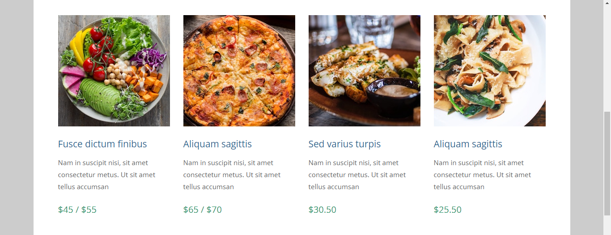
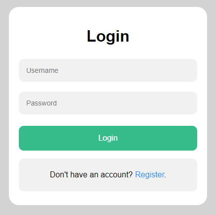

<div align="center" >

<h1> Django Guide</h1>

<p float="left">
  
  
  
  

 


</p>

### [Django Documentation](https://docs.djangoproject.com/en/3.2/topics/)

</div>


<details open>
<summary> Contents </summary>
<br>

- [1. Django Setup](#1-django-setup)
  - [Install Virtual Environment](#install-virtual-environment)
  - [Activate Virtual Environment](#activate-virtual-environment)
  - [Install django using pip](#install-django-using-pip)
  - [Confirm django installation](#confirm-django-installation)
  - [Creating Project](#creating-project)
  - [Starting the Development Server](#starting-the-development-server)
- [2. First App](#2-first-app)
  - [Create a New App](#create-a-new-app)
  - [Adding urls](#adding-urls)
  - [Creating views](#creating-views)
  - [**Congratulations! You have created your first Django App**](#congratulations-you-have-created-your-first-django-app)
  - [**How do we get this ?**](#how-do-we-get-this-)
- [3. Django Template Language](#3-django-template-language)
  - [Creating templates folder](#creating-templates-folder)
  - [Adding templates](#adding-templates)
  - [Dynamic Content](#dynamic-content)
  - [Adding Base Template](#adding-base-template)
- [4. GET vs POST](#4-get-vs-post)
  - [Creating a Form](#creating-a-form)
- [5. Model View Template](#5-model-view-template)
- [6. Static Files](#6-static-files)
  - [Create a new App](#create-a-new-app-1)
  - [Add urls.py](#add-urlspy)
  - [Modify views.py](#modify-viewspy)
  - [Modify djangoproject's urls.py](#modify-djangoprojects-urlspy)
  - [Static Folder](#static-folder)
  - [Add Static Dirs and Root](#add-static-dirs-and-root)
  - [Edit Links and Load Static](#edit-links-and-load-static)
- [7. Passing Dynamic Data](#7-passing-dynamic-data)
  - [Modifying views.py](#modifying-viewspy)
  - [Modifying index.html](#modifying-indexhtml)
- [8. Models](#8-models)
  - [Displaying passed data](#displaying-passed-data)
  - [Passing Multiple Data](#passing-multiple-data)
  - [Using Condition](#using-condition)
- [9. ORM](#9-orm)
- [10. Database Setup](#10-database-setup)
- [11. Models and Migrations](#11-models-and-migrations)
  - [Models](#models)
  - [Migrations](#migrations)
  - [Migrate](#migrate)
- [12. Admin Panel](#12-admin-panel)
- [13. Add Fetch Data](#13-add-fetch-data)
  - [Path for Images(Media)](#path-for-imagesmedia)
  - [Add Dish](#add-dish)
  - [Modify views.py](#modify-viewspy-1)
  - [Image Path](#image-path)
- [14. User Registration](#14-user-registration)
  - [Accounts](#accounts)
- [15. Passing Messages](#15-passing-messages)
- [16. User Login Logout](#16-user-login-logout)
  - [Creating login.html](#creating-loginhtml)
  - [Modifying urls.py](#modifying-urlspy)
  - [Login View](#login-view)
  - [Adding Login Logout Link in index.html](#adding-login-logout-link-in-indexhtml)
  - [Logout View](#logout-view)
  - [Final](#final)

</details>

---
## 1. [Django Setup](#1-django-setup)
Python installation required.
### Install Virtual Environment
  ```
  pip install virtualenv
  ```
  
### Activate Virtual Environment
  ```
  ./env/Scripts/activate
  ```

### Install django using pip
  ```
  pip install django
  ```

### Confirm django installation
  ```
  django-admin --version
  ```

### Creating Project
```
django-admin startproject djangoproject
```

`cd djangoproject`

```
djangoproject
  |__ djangoproject
  |     |__ init.py
  |     |__ asgi.py
  |     |__ settings.py
  |     |__ urls.py
  |     |__ wsgi.py
  |__ manage.py
```

### Starting the Development Server
```
python manage.py runserver
```

**Result :**

```
Django version 3.2.6, using settings 'djangoproject.settings'
Starting development server at http://127.0.0.1:8000/        
Quit the server with CTRL-BREAK.
```

> The development server is live at 
**http://127.0.0.1:8000/**

To Stop the Server
 **CTRL + C** 


---
## 2. [First App](#2-first-app)

### Create a New App
```
python manage.py startapp myapp
```
It will create a new app in the Project Directory named `myapp`

```
djangoproject
  |__ djangoproject
  |__ myapp
  |     |__ init.py
  |     |__ admin.py
  |     |__ apps.py
  |     |__ models.py
  |     |__ tests.py
  |     |__ views.py
  |__ manage.py
```
After creating a new app we have to create a new file in it called `urls.py`. It will store all the urls of this app.

### Adding urls
We have to include this file's urls in the project's urls file.

> djangoproject / **djangoproject / urls.py**
```
from django.contrib import admin
from django.urls import path, include

urlpatterns = [
    path('admin/', admin.site.urls), 
    path('', include('myapp.urls'),
]
```

Now we need to add new urls in the `urls.py` file of `myapp`.

> djangoproject / **myapp / urls.py**
```
from django.urls import path
from . import views

urlpatterns = [ 
    path('', views.home, name='home'), 
] 
```

In this file we have imported views.
And created a path for Home page.

### Creating views

**Now we have to create view for this path in the `views.py`**

> djangoproject / **myapp / views.py**
```
from django.shortcuts import render
rom django.http import HttpResponse

def home(request):
    return HttpResponse("<h1>Hello World!</h1>")> 
```

Save all the files and open **http://127.0.0.1:8000/**


### **Congratulations! You have created your first Django App**

---

### **How do we get this ?**
Django will first search for `home` or `''` url in the urls.py of the project folder i.e. djangoproject.
`path('', include('myapp.urls'),`

It says to search for the url in `myapp/urls.py`
`path('', views.home, name='home'),`

which tells that the `''` url should goto `views.home` i.e. it should look for a function named `home` in the `myapp/views.py` 

```
def home(request):
    return HttpResponse("<h1>Hello World!</h1>")> 
```
This is the home function which returns a HttpResponse to the url `''` for `Hello World`.

---
## 3. [Django Template Language](#3-django-template-language)

### Creating templates folder
```
mkdir templates
```

```
djangoproject
  |__ djangoproject
  |__ myapp
  |__ templates
  |__ manage.py
```

### Adding templates

Create a file `Home.html`
And add the following 

```

<h1>Hello World. This is Home.html</h1>
```
In the `djangoproject/djangoproject/settings.py` add the templates folder in the `DIRS`.

```

TEMPLATES = [
    {
        'BACKEND': 'django.template.backends.django.DjangoTemplates',
        'DIRS': [os.path.join(BASE_DIR,'templates')],
        'APP_DIRS': True,
    },
]
```

Now modify your `djangoproject/myapp/views.py`

```
def home(request):
    return render(request, 'Home.html')
```
It will now render a template named `Home.html` from `templates` folder at the Home or `''` url.

Save all the files and open **http://127.0.0.1:8000/**


### Dynamic Content

Now instead of this static content we want to pass values to Home.html dynamically. 

In the `djangoproject/myapp/views.py` pass values using `{}` a Dictionary as follows.

```
def home(request):
    return render(request, 'Home.html',{'name' : "Shrimad"})
```

And in the `templates/Home.html`
```
<h1>Hello {{name}}</h1>
```
add `{{name}}` to show the passed value here.

Save all the files and open **http://127.0.0.1:8000/**


In this way we can fetch data from the database and pass it in the html file.

### Adding Base Template

In the `templates` folder create a file named `base.html` and add the following html code.

```
<html lang="en">
<head>
    <title>  </title>
</head>
<body bgcolor='lightblue'>
    
    
    
</body>
</html>
```

In this file the `` and `` are used to insert the data from another html file inside these blocks.

Example : 

Let the background color of the base template be `bgcolor='lightblue'`.

Now in the `home.html` add 
```



Django Home



<h1>Hello {{name}}</h1>

```

The `` will extend the base file.

The data inside  `` will be sent to the block title of the `base.html`.

Similarly the data inside `` will be sent to the block content of the `base.html`.

Save all the files and open **http://127.0.0.1:8000/**


The `base.html` file with blue background and the content from `home.html`.

---
## 4. [GET vs POST](#4-get-vs-post)

### Creating a Form
> **Using 'GET' method.**

In the `home.html` modify the content block.

```

<h1>Hello {{name}}</h1>

<form action="add" method="get">
    Enter 1st number : <input type="text" name="num1"><br>
    Enter 2nd number : <input type="text" name="num2"><br>
    <input type="submit" value="Add">
</form>


```

Now create a new file `result.html` to display the Result.

```



Django Add



Result : {{result}}

```

The action will be called i.e. `add`. So we have to add it to the `urls.py` of `myapp`.

```
urlpatterns = [
    path('',views.home,name='home'),
    path('add',views.add,name='add'),
]
```

Create a view for add in `myapp/views.py`.

```
def add(request):
    val1 = int(request.GET['num1'])
    val2 = int(request.GET['num2'])
    result = val1 + val2
    return render(request,'result.html',{'result' : result})
```
We created a variable `val1` and using `request.GET` fetched the value of `num1`.
Same for val2 and calculated result and passed it to `result.html`

Save all the files and open **http://127.0.0.1:8000/**

<div>

`home` : `home.html`           |  `add` : `result.html`
:-------------------------:|:-------------------------:
  |  

</div>

Method GET is used to fetch the data and Method POST is used to submit the data from the server.

Using GET method the data entered can be seen in the url.
But in POST method the data will not be shown in the url.

> **Using 'POST' method**

In the `home.html` change the form method to `post` and add ``

```
<form action="add" method="post">
    
    Enter 1st number : <input type="text" name="num1"><br>
    Enter 2nd number : <input type="text" name="num2"><br>
    <input type="submit" value="Add">
</form>
```

Modify the `add` view in `views.py`

```
def add(request):
    val1 = int(request.POST['num1'])
    val2 = int(request.POST['num2'])
    result = val1 + val2
    return render(request,'result.html',{'result' : result})
```

<div>

`home` : `home.html`           |  `add` : `result.html`
:-------------------------:|:-------------------------:
  |  

</div>

---


## 5. [Model View Template](#5-model-view-template)

<div align='center'>


</div>

**DATA** : It stores all the data from database.

**MODEL** : It is linked to data to access/store it.

**TEMPLATE** : It includes HTML,CSS,JS etc. using DTL

**VIEW** : It includes all the logic and combines Model and Template.

**url** : All the paths used for mapping the project urls.


---

## 6. [Static Files](#6-static-files)

### Create a new App

```
python manage.py startapp simple_house
```

Created a new app called `simple_house`.


```
djangoproject
  |__ djangoproject
  |__ myapp
  |__ simple_house
  |     |__ init.py
  |     |__ admin.py
  |     |__ apps.py
  |     |__ models.py
  |     |__ tests.py
  |     |__ views.py
  |__ templates
  |__ manage.py
```

### Add urls.py 

```
from django.urls import path
from . import views

urlpatterns = [
    path('',views.index,name='index'),
]
```
Create path for index at `''`.

### Modify views.py

```
from django.shortcuts import render

# Create your views here.
def index(request):
    return render(request, 'index.html')
```
Create view for index and render `index.html`.

Add a new `index.html` file in the templates folder.

### Modify djangoproject's urls.py

```
urlpatterns = [
    path('admin/', admin.site.urls),
    path('', include('simple_house.urls')),
]
```
Change the `''` path to include `urls` from `simple_house`.

### Static Folder

Create a Static Folder and add all your static files in it. For example, css, images, js etc.

```
djangoproject
  |__ djangoproject
  |__ myapp
  |__ simple_house
  |__ static
  |__ templates
  |__ manage.py
```
### Add Static Dirs and Root
In the `djangoproject/settings.py` add
```
STATIC_URL = '/static/'
STATICFILES_DIRS = [
    os.path.join(BASE_DIR,'static')
]
STATIC_ROOT = os.path.join(BASE_DIR,'assets')
```

And then run
```
python manage.py collectstatic
```
to (auto)create a folder named `assets` for all the staticfiles.

### Edit Links and Load Static
In the `index.html` add 
`` at the top of the file and change all the links in the following format.
```
<link href="" rel="stylesheet" />
```
 ``

where link is the actual link of the file.

Do this for all the css, js, images etc.

Now you can see the website with all the static content displayed properly.
<div align='center'>





</div>

---

## 7. [Passing Dynamic Data](#7-passing-dynamic-data)

We can pass the price of dishes dynamically.

### Modifying views.py
simple_house / views.py

```
def index(request):
    return render(request, 'index.html',{'price' : 99})
```
Passed a value 99 for price.

### Modifying index.html
simple_house / index.html

```
<article class="col-lg-3 col-md-4 col-sm-6 col-12 tm-gallery-item">
  <figure>
    
    <figcaption>
      <h4 class="tm-gallery-title">Fusce dictum finibus</h4>
      <p class="tm-gallery-description">Nam in suscipit nisi, sit amet consectetur metus. Ut sit amet tellus accumsan</p>
      <p class="tm-gallery-price">${{price}}</p>
    </figcaption>
  </figure>
</article>
```
Replacing the Original price by `{{price}}`
<div align='center'>


</div>

---

## 8. [Models](#8-models)

In `simple_house / models.py` create a class called Dish.
```
from django.db import models

# Create your models here.
class Dish(models.Model):
    id : int
    name : str
    img : str
    desc : str
    price : int
```
And then in `simple_house / views.py` modify
```
from django.shortcuts import render
from .models import Dish

# Create your views here.
def index(request):
    dish1 = Dish()
    dish1.name = "Salad"
    dish1.desc = "A mixture of raw usually green leafy
                  vegetables (as lettuce) combined 
                  with other vegetables (as tomato and
                  cucumber) and served with a dressing."
    dish1.price = 25
    dish1.img = '01.jpg'
    return render(request, 'index.html',{'dish1' : dish1})
```
### Displaying passed data

Modify `index.html` and add
```


```

```
<article class="col-lg-3 col-md-4 col-sm-6 col-12 tm-gallery-item">
  <figure>
    
    <figcaption>
      <h4 class="tm-gallery-title">{{dish1.name}}</h4>
      <p class="tm-gallery-description">{{dish1.desc}}</p>
      <p class="tm-gallery-price">${{dish1.price}}</p>
    </figcaption>
  </figure>
</article>
```
Note that the `baseUrl` name should be correct and the image src should also be valid.

<div align='center'>


</div>

### Passing Multiple Data
In `simple_house / views.py` create 4 dishes and pass them using `dishes`.

This is not a proper way, we will do this using database later.
```
from django.shortcuts import render
from .models import Dish

# Create your views here.
def index(request):

    dish1 = Dish()
    dish1.name = "Salad"
    dish1.desc = "A mixture of raw usually green leafy vegetables (as lettuce) combined with other vegetables (as tomato and cucumber) and served with a dressing."
    dish1.price = 10
    dish1.img = '01.jpg'

    dish2 = Dish()
    dish2.name = "Pizza"
    dish2.desc = "A dish made typically of flattened bread dough spread with a savory mixture usually including tomatoes and cheese and often other toppings and baked"
    dish2.price = 25
    dish2.img = '02.jpg'

    dish3 = Dish()
    dish3.name = "Garlic Bread"
    dish3.desc = "It consists of bread topped with garlic and olive oil or butter and may include additional herbs, such as oregano"
    dish3.price = 20
    dish3.img = '03.jpg'

    dish4 = Dish()
    dish4.name = "Pasta"
    dish4.desc = "Pasta is a type of food typically made from an unleavened dough of wheat flour mixed with water or eggs, and formed into sheets or other shapes"
    dish4.price = 36
    dish4.img = '04.jpg'

    dishes = [dish1, dish2, dish3, dish4]
    return render(request, 'index.html',{'dishes' : dishes})
```

In `index.html` create a for loop for the format code of a Dish like : 
```
<div id="tm-gallery-page-pizza" class="tm-gallery-page">
  
  <article class="col-lg-3 col-md-4 col-sm-6 col-12 tm-gallery-item">
    <figure>
      
      <figcaption>
        <h4 class="tm-gallery-title">{{dish.name}}</h4>
        <p class="tm-gallery-description">{{dish.desc}}</p>
        <p class="tm-gallery-price">${{dish.price}}</p>
      </figcaption>
    </figure>
  </article>
  
</div>
```
In this way every object will be displayed using the same code.


### Using Condition

We can modify the model to add new field `discount` on the `Dish`.

`simple_house / models.py`

```
class Dish(models.Model):
    id : int
    name : str
    img : str
    desc : str
    price : int
    discount : bool
```
Adding it to every Dish in `views.py` like this.

```
 dish1 = Dish()
    dish1.name = "Salad"
    dish1.desc = "A mixture of raw usually green leafy vegetables (as lettuce) combined with other vegetables (as tomato and cucumber) and served with a dressing."
    dish1.price = 10
    dish1.img = '01.jpg'
    dish1.discount = False

    dish2 = Dish()
    dish2.name = "Pizza"
    dish2.desc = "A dish made typically of flattened bread dough spread with a savory mixture usually including tomatoes and cheese and often other toppings and baked"
    dish2.price = 25
    dish2.img = '02.jpg'
    dish2.discount = True
```

And in `index.html`

```
<div class="cont">
  
  
    <div class="top-left disc">Discount</div>
  
  <figcaption>
    <h4 class="tm-gallery-title">{{dish.name}}</h4>
    <p class="tm-gallery-description">{{dish.desc}}</p>
    <p class="tm-gallery-price">${{dish.price}}</p>
  </figcaption>
</div>
```

Use of if statement to check if the dish has discount or not and displaying data accordingly.


---

## 9. [ORM](#9-orm)

One of the most powerful features of Django is its Object-Relational Mapper (ORM), which enables you to interact with your database, like you would with SQL. In fact, Django's ORM is just a pythonical way to create SQL to query and manipulate your database and get results in a pythonic fashion.

---

## 10. [Database Setup](#10-database-setup)

We will be using the `sqlite3` database for our project.

In the `djangoproject/settings.py`
```
DATABASES = {
    'default': {
        'ENGINE': 'django.db.backends.sqlite3',
        'NAME': BASE_DIR / 'db.sqlite3',
    }
}

```
This will create a database named `db.sqlite3` in the Base Dir of the project.

---

## 11. [Models and Migrations](#11-models-and-migrations)

For creating tables in database automatically we need to create Models for out Classes .

### Models

In the `simple_house/models.py` modify

```
class Dish(models.Model):

    name = models.CharField(max_length=100)
    img = models.ImageField(upload_to='pics')
    desc = models.TextField()
    price = models.IntegerField()
    discount = models.BooleanField(default=False)
```
 And `djangoproject/settings.py` add 
```
INSTALLED_APPS = [
    # My Apps
    'simple_house.apps.SimpleHouseConfig',
]
```

Before migrations you should install `Pillow` for working with `ImageField`.

```
python -m pip install Pillow
```

### Migrations

```
python manage.py makemigrations
```

which will create
```
Migrations for 'simple_house':
  simple_house\migrations\0001_initial.py
    - Create model Dish
```
and in `simple_house/migrations/0001_initial.py`
```
class Migration(migrations.Migration):
    initial = True
    dependencies = [
    ]
    operations = [
        migrations.CreateModel(
            name='Dish',
            fields=[
                ('id', models.BigAutoField(auto_created=True, primary_key=True, serialize=False, verbose_name='ID')),
                ('name', models.CharField(max_length=100)),
                ('img', models.ImageField(upload_to='pics')),
                ('desc', models.TextField()),
                ('price', models.IntegerField()),
                ('discount', models.BooleanField(default=False)),
            ],
        ),
    ]
```
### Migrate

Now to pass this data to the database run
```
python manage.py migrate
```
And a new db.sqlite3 will be created with the Model we created.

---

## 12. [Admin Panel](#12-admin-panel)

For accessing the Admin Panel you should be a superuser.
Which can be created by 
```
python manage.py createsuperuser
```
Enter Username, Email, Password and Confirm Password.

Save all the files and open **http://127.0.0.1:8000/admin** to open the admin panel.

After Login you will see an admin panel


But to see our Dish Model we should register it in 
`simple_house/admin.py`

```
from django.contrib import admin
from .models import Dish

# Register your models here.
admin.site.register(Dish)
```

Now we can see the Dish in the Admin Panel under simple_house section.


In this Django will add an `s` at the end of the Model.
So the Dish is displayed as `Dishs`.
 
---

## 13. [Add Fetch Data](#13-add-fetch-data)

### Path for Images(Media)
 
In `djangoproject/settings.py` add 

```
# Media files

MEDIA_URL = '/media/'

MEDIA_ROOT = os.path.join(BASE_DIR,'media')
```

Then in `djangoproject/urls.py` 

```
from django.contrib import admin
from django.urls import path,include
from django.conf import settings
from django.conf.urls.static import static

urlpatterns = [
    path('admin/', admin.site.urls),
    path('', include('simple_house.urls')),
]

urlpatterns += static(settings.MEDIA_URL, document_root=settings.MEDIA_ROOT)
```

### Add Dish

Now goto  **http://127.0.0.1:8000/admin/simple_house/dish/** and add new dishes like this.


### Modify views.py

In `simple_house/views.py` clear all the static data and modify it to
```
def index(request):
    dishes = Dish.objects.all()
    return render(request, 'index.html',{'dishes' : dishes})
```

### Image Path

Now we need to change the path of the images and fetch it from the data.

In `templates/index.html` modify the image src to `{{dish.img.url}}` from `{{baseUrl}}/gallery/{{dish.img}}`. 

```
<div class="cont">
  
  
    <div class="top-left disc">Discount</div>
  
  <figcaption>
    <h4 class="tm-gallery-title">{{dish.name}}</h4>
    <p class="tm-gallery-description">{{dish.desc}}</p>
    <p class="tm-gallery-price">${{dish.price}}</p>
  </figcaption>
</div>
```

Save all the files and open **http://127.0.0.1:8000/**


All the data from the database including images can be seen properly.

## 14. [User Registration](#14-user-registration)

### Accounts

For managing registration and login let's create a new app `accounts`.

```
python manage.py startapp accounts
```

Create a new `urls.py` file in `accounts`.

```
from django.urls import path
from . import views

urlpatterns = [
    path('register',views.register,name='register'),
]
```

Include it in the `djangoproject/urls.py`
```
urlpatterns = [
    path('admin/', admin.site.urls),
    path('', include('simple_house.urls')),
    path('accounts/', include('accounts.urls')),
]
```
Create `register.html` with
```
<div class="form">
    <h1>Register</h1>
    <form action="register" method="post">
        
        <input type="text" name="first_name" id="first_name" placeholder="First Name">
        <input type="text" name="last_name" id="last_name" placeholder="Last Name">
        <input type="text" name="username" id="username" placeholder="Username">
        <input type="email" name="email" id="email" placeholder="Email">
        <input type="password" name="password1" id="password1" placeholder="Password">
        <input type="password" name="password2" id="password2" placeholder="Confirm Password">
        <input type="submit" value="Register" class="registerbtn">
    </form>
    <div class="container link">
        <p>Already have an account? <a href="login">Login</a>.</p>
    </div>
</div>
```
Then create a view for `register` in `accounts/views.py`
```
def register(request):

    if request.method == 'POST':
        first_name = request.POST['first_name']
        last_name = request.POST['last_name']
        username = request.POST['username']
        password1 = request.POST['password1']
        password2 = request.POST['password2']
        email = request.POST['email']

        if password1==password2:    
            if User.objects.filter(username=username).exists():
                print("Username already Taken")
            elif User.objects.filter(email=email).exists():
                print("Email already in use")
            else:
                user = User.objects.create_user(username=username,password=password1,email=email,first_name=first_name,last_name=last_name)
                user.save()
                print('Password Matched')
                return redirect('/')
        else:
            print('Password Not Matched')

    else:
        return render(request,'register.html')
    return redirect('/')

```

Add `accounts/register` path link in `index.html`.
```
<li class="tm-nav-li"><a href="index.html" class="tm-nav-link active">Home</a></li>
<li class="tm-nav-li"><a href="accounts/register" class="tm-nav-link">Register</a></li>
```


---

## 15. [Passing Messages](#15-passing-messages)

Now for every error like 'Username taken' or 'Password not Matched' we need to display it to the user.

So we add 
```
from django.contrib import messages
```

```
if password1==password2:    
    if User.objects.filter(username=username).exists():
        print("Username already taken!")
        messages.info(request,'Username already taken!')
        return redirect('register')
    elif User.objects.filter(email=email).exists():
        print("Email already in use")
        messages.info(request,'Email already in use!')
        return redirect('register')
    else:
        user = User.objects.create_user(username=username,password=password1,email=email,first_name=first_name,last_name=last_name)
        user.save()
        # print('Password Matched!')
        # messages.info(request,'Password Matched!')
        return redirect('/')
else:
    print('Password Not Matched!')
    messages.info(request,'Password Not Matched!')
    return redirect('register')

else:
return render(request,'register.html')
return redirect('/')
```

Using `messages.info(request, "<message>")` we can pass messages to the html file.

To display it 
```

  <div class="container">
    <h4>{{message}}</h4>
  </div>

```
add this in `register.html`

<div align='center'>

Username           |  Password
:-------------------------:|:-------------------------:
  |  

</div>

---

## 16. [User Login Logout](#16-user-login-logout)

### Creating login.html
In the `templates` create `login.html`
```
<div class="form">
    <h1>Login</h1>
    
      <div class="container">
        <h4>{{message}}</h4>
      </div>
    
    <form action="login" method="post">
        
        <input type="text" name="username" id="username" placeholder="Username">
        <input type="password" name="password" id="password" placeholder="Password">
        <input type="submit" value="Login" class="loginbtn">
    </form>
    <div class="container link">
        <p>Don't have an account? <a href="register">Register</a>.</p>
    </div>
</div>
```

### Modifying urls.py
Adding login and logout path
```
urlpatterns = [
    path('register',views.register,name='register'),
    path('login',views.login,name='login'),
    path('logout',views.logout,name='logout'),
]
```

### Login View
Creating View for Login 
```
# Login
def login(request):
    if request.method == 'POST':
        username = request.POST['username']
        password = request.POST['password']

        user = auth.authenticate(username=username,password=password)

        if user is not None:
            auth.login(request,user)
            print("User Logged In")
            return redirect('/')
        else:
            print("Invalid Credentials")
            messages.info(request,'Invalid Credentials')
            return redirect('login')
    else:
        return render(request,'login.html')
```
<div align='center'>

  

</div>

### Adding Login Logout Link in index.html
```
<li class="tm-nav-li"><a href="index.html" class="tm-nav-link active">Home</a></li>

  <li class="tm-nav-li">Hello, {{user.first_name}} </li>
  <li class="tm-nav-li"><a href="accounts/logout" class="tm-nav-link">Logout</a></li>

  <li class="tm-nav-li"><a href="accounts/login" class="tm-nav-link">Login</a></li>
  <li class="tm-nav-li"><a href="accounts/register" class="tm-nav-link">Register</a></li>

```
### Logout View
```
# Logout
def logout(request):
  auth.logout(request)
  return redirect('/')
```
### Final  
<div align='center'>

  
  

</div>

---
